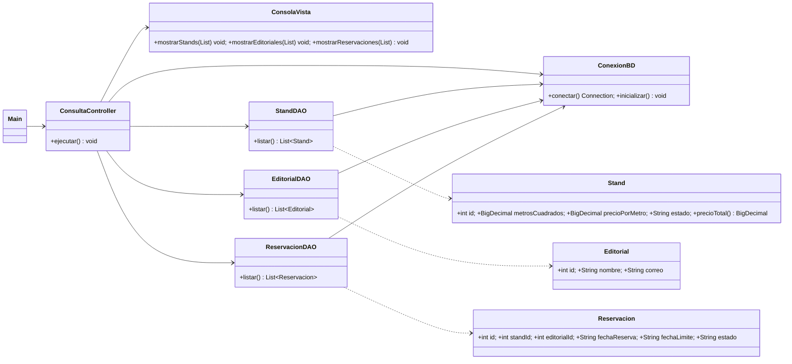

# Diagrama de clases PD4

```mermaid
classDiagram
 direction LR
 class Main
 class ConsultaController { +ejecutar() void }
 class ConsolaVista { +mostrarStands(List) void; +mostrarEditoriales(List) void; +mostrarReservaciones(List) void }
 class ConexionBD { +conectar() Connection; +inicializar() void }
 class Stand { +int id; +BigDecimal metrosCuadrados; +BigDecimal precioPorMetro; +String estado; +precioTotal() BigDecimal }
 class Editorial { +int id; +String nombre; +String correo }
 class Reservacion { +int id; +int standId; +int editorialId; +String fechaReserva; +String fechaLimite; +String estado }
 class StandDAO { +listar() List~Stand~ }
 class EditorialDAO { +listar() List~Editorial~ }
 class ReservacionDAO { +listar() List~Reservacion~ }
 Main --> ConsultaController
 ConsultaController --> ConsolaVista
 ConsultaController --> ConexionBD
 ConsultaController --> StandDAO
 ConsultaController --> EditorialDAO
 ConsultaController --> ReservacionDAO
 StandDAO --> ConexionBD
 EditorialDAO --> ConexionBD
 ReservacionDAO --> ConexionBD
 StandDAO ..> Stand
 EditorialDAO ..> Editorial
 ReservacionDAO ..> Reservacion
```
