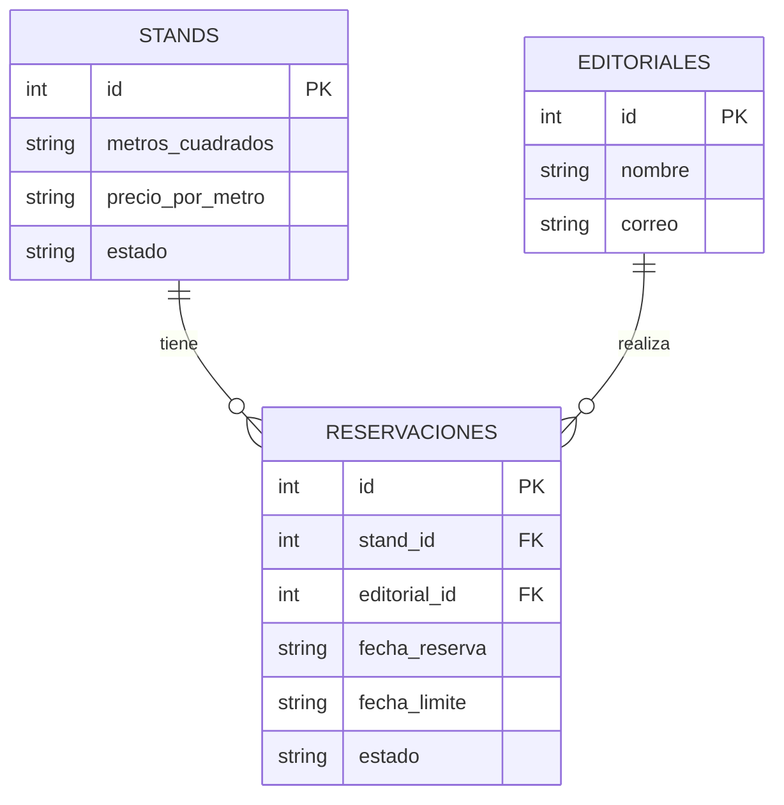

# Diagrama Entidad-Relación PD5

```mermaid
erDiagram
 STANDS ||--o{ RESERVACIONES : "tiene"
 EDITORIALES ||--o{ RESERVACIONES : "realiza"
 STANDS {
  int id PK
  string metros_cuadrados
  string precio_por_metro
  string estado
 }
 EDITORIALES {
  int id PK
  string nombre
  string correo
 }
 RESERVACIONES {
  int id PK
  int stand_id FK
  int editorial_id FK
  string fecha_reserva
  string fecha_limite
  string estado
 }
```
